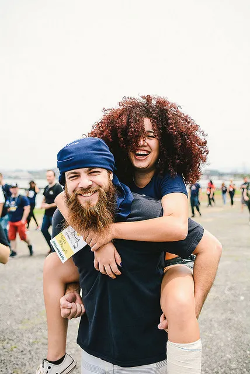
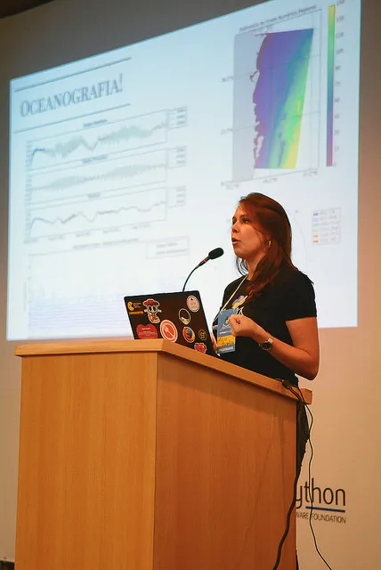
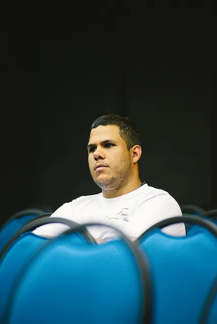
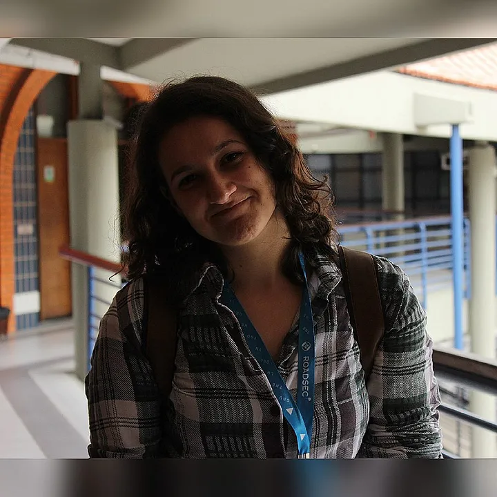
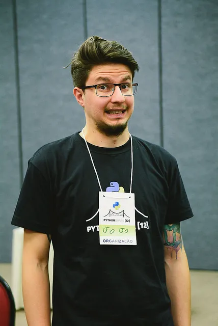
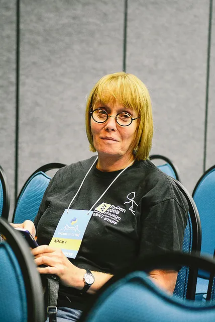
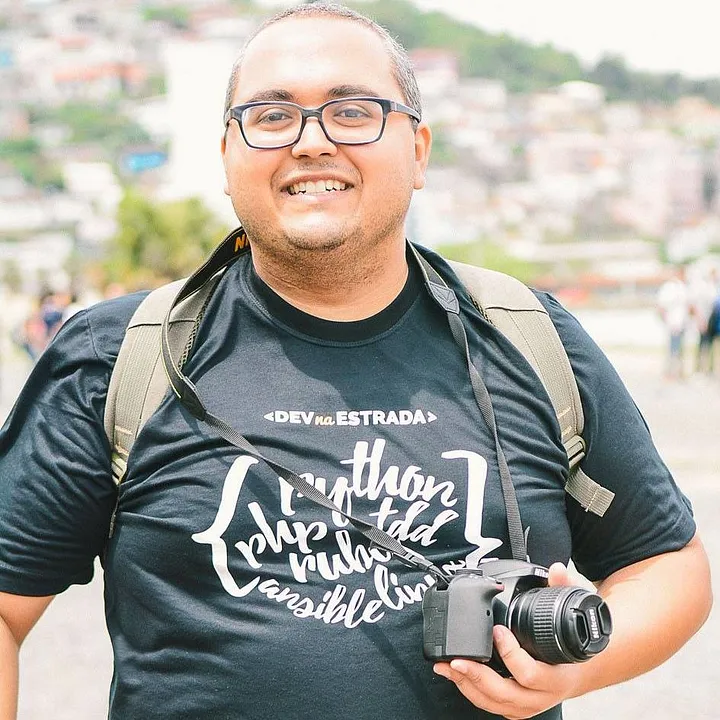
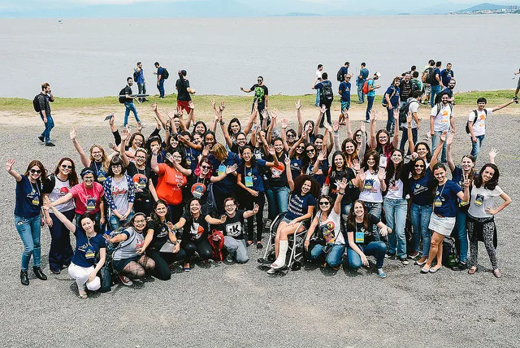

Em novembro de 2015 acontecia a Python Brasil[11] em São José dos Campos/SP, durante o evento os membros da Associação Python Brasil (APyB) iriam definir a cidade sede da Conferência Python Brasil[12], evento que seria realizado no ano de 2016. Na ocasião, Florianópolis enviou candidatura para se tornar sede da conferência.

Apesar de não querer ser o organizador oficial, eu era o único membro da comunidade que estava no evento que escolheria a sede da Python Brasil[12]. Decidi defender a candidatura, o que me deixou levemente apavorado.

O que aconteceu foi um fato pouco provável nesse dia, pois mesmo eu sendo um exército de um homem só, a comunidade resolveu escolher Florianópolis como sede de 2016. Agora sim, eu estava totalmente apavorado :P

O que eu não tinha entendido no início, é que a Python Brasil não se tratava de um evento de tecnologia, mas é um evento raro, que trata de relacionamentos, amizade e inclusão.

Quando eu percebi essa característica emergir à minha volta e sendo praticada ativamente, entendi tudo o que eu estava fazendo. **Nós não estávamos preparando um evento de Python, estávamos preparando um evento para inclusão de pessoas no cenário de tecnologia.** Dessa forma, um dia decidi que iríamos colocar a seguinte expressão na camisa oficial do evento:

“Pessoas > tecnologia” As pessoas são mais importantes que a tecnologia.

Você pode fazer o seguinte questionamento: Então a Python Brasil não é uma conferência da linguagem de programação Python?

Para ajudá-los a entender o porque de não se tratar apenas de uma conferência de tecnologia, irei contextualizar a Python Brasil na ótica da organização, e depois dividir algumas histórias incríveis, de pessoas que foram na Python Brasil para fazer nós vivermos experiências inesquecíveis. Isso é muito importante, porque justifica todo o esforço de energia que existe para que tudo aconteça.

<h2>Generosidade</h2>
A Python Brasil é um evento sem fins lucrativos, onde as pessoas que organizam e colaboram fazem isso de forma completamente voluntária, o que exige bastante esforço, tempo e dedicação exclusiva nos dias que a antecedem.

Inclusive faço aqui um agradecimento público à [Smarket Solutions](https://smarket.com.br/), por meio da Marcela Viegas e Paulo Henrique, pois eles usaram de uma extrema paciência e compreensão, durante um período de tempo razoável da organização da Conferência.

**Organização**: Na equipe de apoio, existiam pessoas que estavam ali apenas porque queriam ajudar um amigo ❤ que pegou uma conferência para organizar sem ter a mínima experiência. Perdi as contas de quanta gente virou noites para corrigir erros que eu cometi relacionados a burocracias financeiras, material de design etc…

Outros, estavam ali ajudando para devolver à comunidade o carinho que outrora receberam de outras pessoas, que doaram os seus recursos de tempo e conhecimento para ensiná-los. A sinergia em prol da conferência é um acontecimento pouco comum de se observar em qualquer outro grupo e pessoas que já tive contato.

**Associação Python Brasil (APyB)**: A Python Brasil é um evento também de responsabilidade da APyB, que fornece uma base fiscal e financeira, para abstrair os processos com patrocinadores, fornecedores e parceiros. Mas além disso, no ano de 2016 a APyB foi MUITO mais do que apenas o seu papel propõe.

Recebemos apoio institucional, fiscal e emocional dos membros da associação. Com eles presentes, resolvemos os conflitos mais complexos e delicados, que envolviam gerir a comunicação e execução do evento. As ajudas foram desde membros da diretoria usarem recursos próprios para pagar compromissos assumidos por mim frente ao evento até ligações privadas para simplesmente mostrarem que eu não estava ali sozinho. ❤

<h2>Protagonistas</h2>
Respira fundo aí, porque eu me emocionei cada vez que tive que revisar essa parte do texto.

Aqui você perceberá o impacto que é gerado ao quebrar barreiras de entrada em um ambiente, ao construir um ecossistema com características de empatia e desconstrução de quaisquer tendências à idolatria de indivíduos. Perceba também que os protagonistas citados a seguir, poderiam ter sido facilmente ignorados, por talvez não agregarem muito à modelos superficiais de aceitação em qualquer nicho específico.

<h3>Raquel e Cristiane Aline</h3>
Eu estava em um corre-corre brutal no primeiro dia do evento principal, no centro de convenções. Eu tinha virado a noite e havia muitas pendências com fornecedores do centro de convenções nesse dia, como alvarás de bombeiros e prefeitura, emissão de notas fiscais e coisas do gênero.

Então, coloquei algumas pessoas para conduzir o evento, e fui resolver as “tretas”. Nesse tumulto todo, me vem o Jairo (JJ) com duas moças extremamente bem vestidas e estilosas para que eu conversasse com elas. Me lembro que no primeiro momento não pude atender, depois voltei para examinar o que era.

Basicamente elas estavam em um evento de moda, que também estava ocorrendo no centro de convenções, e decidiram romper as barreiras de separação para ver o que era aquela galera de Python. A verdade é que alguma coisa chamou a atenção delas, mas essa história eu prefiro a versão que elas mesmo contaram, no vídeo abaixo. :)

Histórias como a da Cris e da Raquel, são como combustíveis que estimulam as pessoas a continuarem contribuindo ❤

<h3>Jessica Temporal</h3>
O nome dessa moça aí já diz tudo. Onde ela chega dificilmente se passa despercebida, ela é uma pessoa extremamente sincera e autêntica.

No primeiro dia do evento a Temporal resolveu torcer o pé na ida para o almoço com a galera. Naquela hora talvez tenha passado na cabeça dela que o evento tinha acabado ali, pois ainda havia mais 5 dias de conferência e happy hours (na verdade quase todo mundo achou). Ela chorou de dor ali na hora, mas depois mostrou a força que tinha, pois piadas começaram a surgir com a situação em que ela estava, e logo veio o sorrisão em seu rosto. :)

A comunidade sendo incrível do jeito que é, logo arrumou uma vaquinha e compraram muletas para ela. Além disso, vários voluntários queridux ficaram levando ela para lá e para cá nas costas, já outros usaram ela para brincar de drift com a cadeira de rodas. \o/

Esse ai na foto com ela é o Rougeth, inclusive ele quem deu um curso de Django para a Jessica na USP, apresentando a comunidade para ela. É muita gente legal né?!!

A Jessica se formou em Informática Biomédica e hoje é uma das cientistas de dados da Operação Serenata de Amor.

Tem gente que entra no time, veste a camisa 10 e pega a faixa de capitão, o resumo dela é esse :P

<h3>Leticia Portella</h3>
Seis meses depois que saí de Brasília para Florianópolis, conseguimos fazer o primeiro encontro da comunidade na ilha. A Leticia compareceu, pois trabalhava em uma empresa de engenharia como oceanógrafa, e usava Python para várias coisas por lá.

Infelizmente esse encontro foi dominado por palestras que abordavam apenas de tecnologias web, digo isso pois na época ela não tinha muita familiaridade com essa área. Me lembro de vê-la bem deslocada sentada num puff que tinha no local. Dava para ver a frustração dela de estar ali. O fato é que depois organizamos mais uns dois ou três encontros e ela nunca mais apareceu.

Sendo assim, convoquei na época o Ivan Ogasawara para dar uma palestra introdutória sobre Numpy. Então, consegui convidá-la novamente pois havia um tema no qual ela tinha mais afinidade para interagir.

O tempo vai passando, e a Leticia começou a sacudir a sua vida com mudanças extremamente corajosas: primeiro se tornou desenvolvedora de software, depois mudou de cidade, dividiu muitas histórias e conhecimentos em conferências por todo o Brasil. E hoje ela está trabalhando como cientista de dados, tudo isso com o seu mestrado correndo em paralelo. E você ainda fica aí chamando o Rodrigo Hilbert de “homão da porra”… :P

Durante a conferência a Leticia foi o meu braço direito, passou o dia do seu aniversário todo trabalhando de forma desgastante para dar atenção para tudo e todos. Uma pena que eu não dei o carinho e atenção que eu deveria ter dado para ela nesse dia. Espero que eu consiga retribuir tudo o que ela já fez por mim.

Essa mulher ainda vai sacudir esse mundo, aguardem… ❤

<h3>James Peres</h3>
O James foi um cara que surgiu no meio da galera durante a conferência, sendo que eu não entendia se ele era de alguma empresa que estava patrocinando ou aluno de algum parceiro do evento. Foi quando em um happy hour sentei na mesa do bar com ele, e pude descobrir tudo sobre essa nobre pessoa.

A história dele era mais ou menos assim… Meses antes da Python Brasil ele largou sua carreira nas forças armadas para se aventurar na área de tecnologia. Depois de ter participado de um PythonRio, comprou uma passagem para Florianópolis e um ingresso para a Python Brasil, pois várias pessoas haviam comentado com ele que seria a melhor experiência de sua vida. Olha só a minha responsabilidade :P

Se você quiser saber o que o James achou da Python Brasil, ele escreveu o texto [“O que a comunidade Python tem para te oferecer!”](https://medium.com/@james.peres.s/o-que-a-comunidade-python-tem-para-te-oferecer-1391a8a06f51). Pessoalmente já conversamos sobre essa nossa experiência e foi um dos feedbacks mais sinceros que eu recebi.

Conclusão, o James assumiu a frente de um monte de coisas dentro da comunidade Python, participou ativamente da organização da Python Sudeste no Rio de Janeiro e outros encontros menores. No momento em que eu escrevo esse texto provavelmente ele deve estar sentindo frio na Irlanda, como bom carioca que é. =D

Keep Walking marinheiro!

<h3>Talita Rossari</h3>
Um mês antes da Python Brasil organizei um encontro da comunidade Python Floripa para 100 pessoas. Na ocasião foi um evento casado com o grupo PyLadies Floripa. Nesse dia apareceram três jovens que ficaram no fundo da sala quietinhos, no início fui comprimentá-los mas a conversa não fluiu muito. Uma dessas pessoas era a Talita, que depois desse dia começou a interagir muito nos grupos, movimentando as coisas e puxando iniciativas.

Algumas semanas depois a Talita já estava fazendo parte do nosso time de organização que iria ralar na Python Brasil. Ela é uma pessoa que anseia por fazer as coisas, um perfil de gente que chega e faz as coisas acontecerem. Nos dias da conferência era nítido o esforço de energia dela para fazer a Python Brasil acontecer.

Atualmente a Talita puxa ativamente o grupo das PyLadies em Florianópolis, onde organiza cursos e capacitação para mulheres e está sempre disponível para ajudar as pessoas. É bem verdade que as vezes ela é bem impulsiva mas, assim como eu, ela é muito jovem e estamos aprendendo e crescendos juntos :)

Conte comigo sempre Talita! ❤

<h3>Jonatas Baldin</h3>
Jojo… Um dia eu estava trabalhando e recebi um email de um garoto que tinha recém chegado em Floripa de Cascavel/PR. Ele queria muito participar da Python Brasil, mas tava meio sem grana e se dispôs a fazer parte da organização. Eu achei a atitude foda e procurei ele no Telegram.

Depois de termos trocado algumas mensagens eu continuei sem o conhecer pessoalmente, e fiquei até achando que ele não iria na Python Brasil. Porém, às 07h da manhã do primeiro dia de tutoriais ele já estava lá, muito antes de eu chegar. Naquele dia ele agilizou muitas tarefas, ficou parecendo que ele já sabia o que tinha que fazer.

Depois da Python Brasil, nos tornamos grandes amigos. E ele se tornou um baita palestrante. Esse maluco vai palestrar na próxima PyCon South Africa, o muleque tá no mundo!

Vlw muito Jojo ❤

<h3>Naomi Ceder</h3>
Dentro do processo de escolha de Keynotes que havíamos estabelecido, o Bernardo Fontes indicou a Naomi Ceder. Após a indicação, eu assisti uma palestra dela no YouTube e a partir daí eu não conseguia imaginar uma Python Brasil em que eu estivesse organizando sem ela nos ensinando tudo aquilo sobre inclusão.

Fizemos contato, trocamos alguns emails e depois de um tempo ela respondeu que viria ao Brasil e que tinha pouco tempo para aprender português \o/

A Naomi vai ficar para sempre marcada na minha cabeça, porque foi a primeira pessoa em que eu tentei conversar em inglês. Esse foi um momento de quebra de barreiras para mim. Todavia a serenidade dela me ajudou muito a não ficar muito nervoso e travar. Parece raso isso, mas foi um dos momentos mais importantes de tudo para mim.

Acredito que a Naomi se sentiu muito bem aqui em Florianópolis, ela saiu conosco em várias atividades pós-evento e interagiu bastante com todos, sempre se esforçando muito para conversar com as pessoas em português e inclusive se saiu muito bem. Além disso, ela foi muito importante para ajudar a fortalecer a comunidade das PyLadies Brasil. Percebo nas redes sociais que até hoje a Naomi tem uma forte conexão com a comunidade Python Brasil ❤

Thank you very much Naomi :)

<h3>Samuel Sampaio (Professor Samuka)</h3>

A primeira vista ele é meio estabanado, com um tom de voz alto e um estilo bem sociável e extrovertido. Além dessas características, é importante adiantar que o coração desse jovem é gigante ❤

O Samuca tinha participado da Python Brasil[11], que foi o seu primeiro evento. Ele ficou tão encantado com a galera que decidiu participar da organização em Florianópolis e, mesmo estando em São Paulo, ele estava presente para se mostrar prestativo com o que precisasse.

Ele quem conduziu a confecção do prêmio Dorneles Treméa, ajudou com a locomoção dos nossos Keynotes internacionais pela ilha (mesmo sem conhecer a cidade). Além disso, ele encorajou os iniciantes na área a continuarem, o que para mim foi a sua principal contribuição.

Por fim, durante os dias do evento ele pegou algumas pessoas que não sabiam quase nada de programação, para ensinar Python básico. Começava assim a então escolinha do professor Samuka :P

<h3>PyLadies Brasil</h3>
Na assembleia da APyB de 2015 foi levantada uma questão sobre inclusão, pois a participação feminina nos eventos de Python até então era baixa (assim como a maioria dos eventos de tecnologia). Dessa forma, assumi um compromisso de tentar fomentar iniciativas de inclusão, para que juntos, conseguíssemos uma participação feminina de 30% na Python Brasil[12].

Ainda na Python Brasil[11], fui em um tutorial do Fernando Masanori sobre comunidade. Nesse tutorial ele explicou o funcionamento e organização de várias comunidades pelo mundo, e focou bastante na mensagem de que devemos deixar as pessoas serem protagonistas, para que a inclusão ocorra de forma natural. Esse tutorial foi muito importante, naquele momento eu decidi que eu mesmo iria fundar o grupo de PyLadies em Floripa.

O que aconteceu foi que no retorno a Florianópolis a vida nos deu um presente no melhor momento, a Julia Machado. Ela estava puxando iniciativas de empoderamento feminino na área de empreendedorismo e tecnologia, por meio do recém criado Conexão Anitas. Foi perfeito, eu e a Julia promovemos o primeiro encontro de PyLadies no Cesusc, e depois disso ela conectou um monte de gente legal e o grupo fluiu muito rápido.

Em paralelo a isso, várias mulheres em diversos estados no Brasil estavam conquistando espaço para organizar vários eventos de capacitação e inclusão, não somente na comunidade Python mas também em outras comunidades. O resultado disso foi que várias palestras de excelente qualidade técnica foram submetidas por elas para a Python Brasil. Com isso, tivemos 42% de palestras ministradas por mulheres.

A verdade é que elas enriqueceram muito a conferência, pois fizeram um financiamento coletivo no Catarse que ajudou a divulgar mais ainda a Python Brasil, venderam brindes durante todo o evento para a galera, movimentaram os Sprints com muitas atividades e ajudaram a fazer de nós um grupo ainda mais diverso \o/

E claro que não faltaram ajudas delas também para o desesperado aqui. A começar pela atenção que elas davam para as pessoas iniciantes que chegavam na comunidade naqueles dias. Além disso, em um dos dias da conferência tivemos um palestrante que cancelou sua participação. O que a gente faz? Procura quem resolve… Procurei a Paola Katherine e pedi uma palestra, e em minutos já estava em todos os canais a palestra da Thais Viana sobre Algpedia.

Obrigado por tudo Ladies ❤

<h2>Conclusão</h2>
É assim, quando se tem um ambiente altamente inclusivo e amigável, onde as limitações das pessoas não são vistas como algo desqualificável, as pessoas simplesmente emergem de forma orgânica.

É absolutamente fantástico assistir pessoas chegando acanhadas em um evento, e de repente, a partir de um gesto simples são convidadas para uma rodinha de conversa no corredor ou são encorajadas por desconhecidos a compartilhar suas histórias, nesses exatos momentos estamos dando um gatilho emocional que pode promover eventos inimagináveis.

A beleza de tudo isso está no desejo de buscar a raridade que existe dentro de cada vida ❤

<blockquote class="twitter-tweet">
Inclusão é trazer para interagir quem está fora do ecossistema. Para que todos se beneficiem, e qualquer indivíduo assuma o protagonismo ;)
&mdash; Mário Sérgio (@sergiomarioq) <a href="https://twitter.com/sergiomarioq/status/890727566428041216?ref_src=twsrc%5Etfw">July 28, 2017</a></blockquote>

Gostaria de convidá-los para olharem as fotos da Conferência Python Brasil[12]. Perceba a felicidade no rosto das pessoas. ❤

Dois recados:

Se você ainda não sentiu um clima parecido com tudo isso que eu descrevi, experimente ir em uma Python Brasil. A próxima será em Belo Horizonte, mais informações aqui.
E se você for, chega fazendo barulho e senta na janela. A gente gosta assim ;)
A expressão lógica ‘pessoas > tecnologia’, não vale somente para a camisa da Python Brasil[12].

Bjos :*
